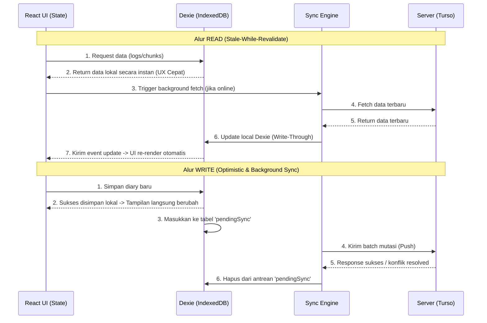

# ADR-058: Offline-First PWA Architecture with Dexie.js

SwaraLingo currently requires a persistent network connection for all features — diary entries, sentence chunks, journals, and audio recordings all fail when offline. We are adopting an **offline-first Progressive Web App (PWA)** architecture using **Dexie.js** (IndexedDB wrapper) for client-side storage, `vite-plugin-pwa` for service worker and manifest generation, and a custom client-push sync protocol (`POST /api/sync`) with last-write-wins conflict resolution. The primary motivation is Indonesian mobile connectivity (commuters, rural users) and the UX expectation that a practice app should never show a spinner because the network dropped.

## Considered Options

| Option | Rejected Because |
|---|---|
| **PGlite** (PostgreSQL WASM) | Backend is Turso/Libsql (SQLite dialect). Maintaining two Drizzle schemas (libsql + pglite) for identical tables is a permanent maintenance tax. Bundle size ~3MB gzip — unacceptable for mobile-first Indonesian users. |
| **Tinybase** | Weak query model — no compound indexes, table-scan filters only. SwaraLingo needs filtered/searchable/date-ranged queries (diary history, chunk SRS review). Audio blobs awkward (JSON-only cells, forced base64). CRDT sync is overkill for single-user app — same person, same device, conflicts are rare. |
| **Raw IndexedDB** | Terrible API. Callback-based, verbose transactions, no query builder. Nobody should write raw IDB in 2026. |
| **Service Worker cache only** (no client DB) | Read-only stale cache — user can't create diary entries, record audio, or practice offline. Defeats the purpose. |
| **OPFS SQLite** (`@sqlite.org/sqlite-wasm`) | Full SQLite in browser is powerful but heavy. Drizzle-compatible but overkill for a client cache. Better for apps that need local SQL for complex analytical queries — SwaraLingo's offline needs are CRUD + blob storage. |

## Decision

- **Dexie.js** for client-side storage (20KB gzip, native Blob support for audio recordings, compound indexes, schema versioning)
- **`vite-plugin-pwa`** for service worker (Workbox) + web manifest auto-generation
- **Client-push sync** via `POST /api/sync` batch endpoint with idempotency key, triggered by `online` event + page visibility + periodic timer + manual "Sync now" button
- **Last-write-wins** conflict resolution using `clientUpdatedAt` timestamps
- **Progressive hydration** — each page loads its data on first visit and caches locally (no upfront snapshot download)
- **Opt-in rollout** — "Enable Offline Mode" toggle in Settings, backfills recent 30 days of data on activation
- **Independent client schema** — Dexie tables are read-optimized subset views, not 1:1 mirrors of Drizzle server schema
- **Audio blobs** in separate Dexie table — text syncs fast (KBs), audio uploads progressively with progress indicator
- **Offline interceptor** in `apiFetch` — GET serves from Dexie when offline, POST/PUT/DELETE queues mutations and returns optimistic responses

## Consequences

- **New frontend module** `frontend/src/offline/` containing Dexie schema, sync engine, service worker config, and UI indicators
- **New backend endpoint** `POST /api/sync` with idempotency support and per-table mutation routing
- **New backend middleware** Content-Security-Policy headers (`worker-src`, `manifest-src`) for PWA compliance
- **New dependency** `vite-plugin-pwa` (dev), `dexie` + `dexie-react-hooks` (runtime) — combined ~30KB gzip
- **New Playwright E2E tests** for offline diary → online sync flow
- **New Vitest unit tests** with `fake-indexeddb` for Dexie operations and sync queue logic
- **No user-facing breaking changes** — offline mode is opt-in toggle. Existing online-only behavior preserved when toggle is off

## Sync Workflow

